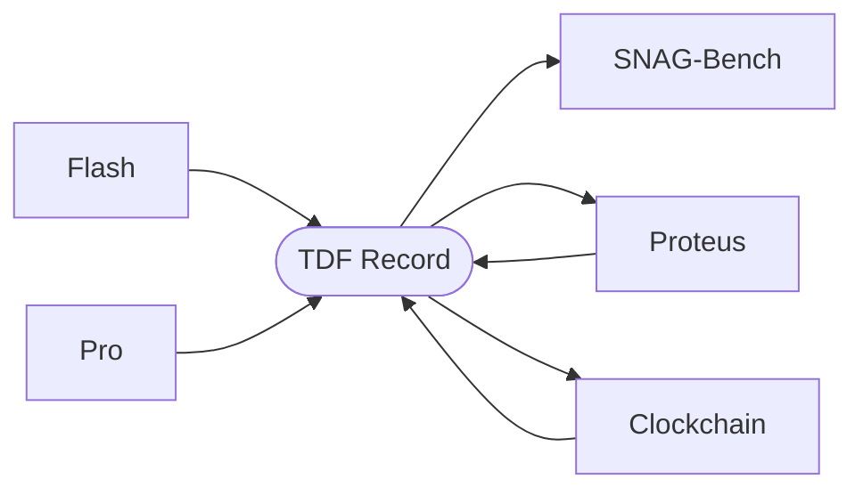

# timepoint-tdf

**Timepoint Data Format** — a canonical envelope for temporal causal data across the Timepoint suite.

Every service in Timepoint (Flash, Pro, Clockchain, SNAG-Bench, Proteus) produces structurally different data — historical scenes, causal simulations, graph nodes, quality scores, predictions. TDF normalizes all of them into a single content-addressed record type so downstream consumers can ingest any record without knowing which service produced it.

**Design principle:** uniform envelope, varying payload. The eight envelope fields (`id`, `version`, `source`, `timestamp`, `provenance`, `payload`, `entity_ids`, `tdf_hash`) are fixed across all sources. The `payload` dict schema varies by source. The `tdf_hash` (SHA-256 of the canonicalized payload) gives you content-addressable deduplication when the same event flows through multiple services.



## Record Model

Every `TDFRecord` shares this envelope:

| Field | Type | Description |
|-------|------|-------------|
| `id` | str | Clockchain canonical URL, Flash/Pro UUID, or `proteus-market-{id}` |
| `version` | str | TDF record schema version (default `1.0.0`) |
| `source` | Literal | `clockchain`, `flash`, `pro`, `proteus`, `snag-bench` |
| `timestamp` | datetime | When the record was created |
| `provenance` | TDFProvenance | Cross-service lineage (see below) |
| `payload` | dict | **Source-specific content** (see payload schemas below) |
| `entity_ids` | list[str] | Entity registry IDs referenced by the record (default `[]`) |
| `tdf_hash` | str | SHA-256 of canonicalized payload (content-addressed) |

`TDFProvenance` tracks cross-service lineage. Its only required field is `generator`; all others are optional: `run_id`, `confidence`, `flash_id`, `text_model`, `image_model`, `model_provider`, `model_permissiveness`, `schema_version`, `generation_id`, `grounding_model`, `grounding_status`, `grounded_at`. `flash_id` preserves the originating Flash UUID even when the canonical `id` is a Clockchain URL, so you can always trace a record back to its source rendering.

## Payload Schemas by Source

The payload is where data diverges. Each transform projects source-specific fields into the payload:

**Flash** — full spatio-temporal-narrative content of a rendered historical moment (18 fields):

`query`, `slug`, `year`, `month`, `day`, `season`, `time_of_day`, `era`, `location`, `latitude`, `longitude`, `scene_data`, `character_data`, `dialog`, `grounding_data`, `moment_data`, `metadata`, `entity_ids`

**Pro** — causal simulation output (4 fields):

`entities`, `dialogs`, `causal_edges`, `metadata`

**Clockchain** — graph node pass-through (all node fields minus internal keys like `path`, `created_at`, `confidence`, and the model/grounding provenance keys; confidence and provenance metadata are promoted into `provenance`)

**Proteus** — prediction-market resolution (10 fields):

`actor_handle`, `actual_text`, `predicted_text`, `levenshtein_distance`, `winning_submission_id`, `submission_count`, `total_pool`, `tx_hash`, `block_number`, `gas_used`

## Example Record

A Flash scene rendered as TDF:

```json
{
  "id": "a1b2c3d4-...",
  "version": "1.0.0",
  "source": "flash",
  "timestamp": "2026-03-01T12:00:00Z",
  "provenance": {
    "generator": "timepoint-flash",
    "run_id": null,
    "confidence": null,
    "flash_id": "a1b2c3d4-..."
  },
  "payload": {
    "query": "assassination of Archduke Franz Ferdinand",
    "slug": "franz-ferdinand-assassination",
    "year": 1914, "month": 6, "day": 28,
    "season": "summer",
    "time_of_day": "morning",
    "era": "early_20th_century",
    "location": "Sarajevo, Bosnia",
    "latitude": 43.8563,
    "longitude": 18.4131,
    "scene_data": { "..." : "..." },
    "character_data": { "..." : "..." },
    "dialog": [ "..." ],
    "grounding_data": { "..." : "..." },
    "moment_data": { "..." : "..." },
    "metadata": { "..." : "..." },
    "entity_ids": [ "..." ]
  },
  "entity_ids": [],
  "tdf_hash": "e3b0c44298fc1c14..."
}
```

## Transforms

| Function | Input | Output |
|----------|-------|--------|
| `from_flash(timepoint)` | Flash scene dict | TDFRecord with 18-field payload |
| `from_pro(run_data)` | Pro run output dict | TDFRecord with causal graph payload |
| `from_clockchain(node)` | Clockchain node dict | TDFRecord with canonical URL as id, confidence in provenance |
| `from_proteus(resolution)` | Proteus market resolution dict | TDFRecord with `proteus-market-{id}` as id |

Two helpers are also exported: `infer_model_permissiveness(model_id)` classifies a model ID as `permissive`/`restricted`/`unknown`, and `SCHEMA_VERSIONS` maps Clockchain schema versions to descriptions.

## I/O

Records serialize to JSONL — one JSON object per line, streamable into any training pipeline:

```python
from timepoint_tdf import TDFRecord, from_flash, write_tdf_jsonl, read_tdf_jsonl

record = from_flash(timepoint_dict)
write_tdf_jsonl([record], "output.jsonl")
records = read_tdf_jsonl("output.jsonl")
```

## Install

```bash
pip install -e .
```

Requires Python 3.10+ and Pydantic 2.0+.

## Changelog

### v1.3.1 (2026-05-18)

- `from_clockchain()` treats empty/whitespace timestamps as `None` instead of raising
- Add `latitude`/`longitude` to the Flash location payload schema
- Add grounding provenance fields (`grounding_model`, `grounding_status`, `grounded_at`) to `TDFProvenance`

### v1.3.0 (2026-03-23)

- Add `entity_ids` field to `TDFRecord`
- `from_flash()` projects `entity_ids` into the record

### v1.2.1 (2026-03-13)

- Add `stabilityai` to permissive model allowlist
- Security: remove private repo references from README

### v1.2.0 (2026-03-11)

- Add Clockchain schema versioning and model provenance fields to `TDFProvenance`
- Add `from_proteus()` transform for prediction-market resolutions
- Add `infer_model_permissiveness()` helper and `SCHEMA_VERSIONS` map

### v1.1.0 (2026-03-02)

- `from_flash()` now extracts the full Flash payload from Flash timepoints
- Missing optional fields default to `None` instead of being omitted
- Branch protection enforced on `main` (1 approval required, no force pushes)

## Timepoint Suite

Open-source engines for temporal AI. Render the past. Simulate the future. Score the predictions. Accumulate the graph.

| Service | Type | Repo | Role |
|---------|------|------|------|
| **API Gateway** | Private | timepoint-api-gateway | Auth authority — JWT, OAuth (Apple/Google/GitHub), credits, rate limiting, request routing |
| **Flash** | Open Source | timepoint-flash | Reality Writer — pure generation engine (no auth), renders grounded historical moments |
| **Pro** | Open Source | timepoint-pro | SNAG Simulation Engine — temporal simulation, TDF output, training data |
| **Clockchain** | Open Source | timepoint-clockchain | Temporal Causal Graph — 1,900+ nodes, 5M+ edges, MCP endpoint, growing 24/7 |
| **SNAG Bench** | Open Source | timepoint-snag-bench | Quality Certifier — measures Causal Resolution across renderings |
| **Proteus** | Open Source | proteus | Settlement Layer — prediction markets that validate Rendered Futures |
| **TDF** | **Open Source** | **timepoint-tdf** | **Data Format — unified data interchange across all services** |

## License

Apache-2.0
