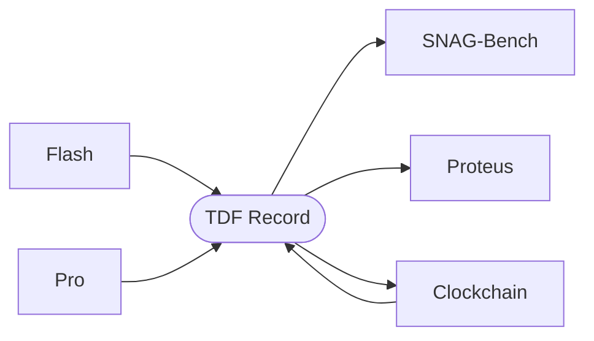

# timepoint-tdf

**Timepoint Data Format** — JSON-LD interchange for temporal causal data. Every service in the Timepoint suite speaks TDF: Flash scenes, Pro simulation outputs, Clockchain nodes, SNAG-Bench scores, and Proteus predictions are all expressible as TDF records.

## Changes 2026-03-02 — v1.1.0: Full Flash payload support

- `from_flash()` now extracts all 16 fields from Flash timepoints: query, slug, year, month, day, season, time_of_day, era, location, scene_data, character_data, dialog, grounding_data, moment_data, metadata
- Missing optional fields default to `None` instead of being omitted
- Branch protection enforced on `main` (1 approval required, no force pushes)



## Record Model

Each `TDFRecord` contains:

| Field | Type | Description |
|-------|------|-------------|
| `id` | str | Clockchain canonical URL or Flash/Pro UUID |
| `source` | Literal | `clockchain`, `flash`, `pro`, `proteus`, `snag-bench` |
| `timestamp` | datetime | When the record was created |
| `provenance` | TDFProvenance | Generator, run_id, confidence, flash_id |
| `payload` | dict | Source-specific content |
| `tdf_hash` | str | SHA-256 of canonicalized payload (content-addressed) |

## Transforms

| Function | Input | Output |
|----------|-------|--------|
| `from_flash(timepoint)` | Flash scene dict | TDFRecord (query, slug, year, month, day, season, time_of_day, era, location, scene_data, character_data, dialog, grounding_data, moment_data, metadata) |
| `from_pro(run_data)` | Pro run output dict | TDFRecord (entities, dialogs, causal_edges, metadata) |
| `from_clockchain(node)` | Clockchain node dict | TDFRecord (canonical URL as id, confidence in provenance) |

## I/O

```python
from timepoint_tdf import TDFRecord, from_flash, write_tdf_jsonl, read_tdf_jsonl

record = from_flash(timepoint_dict)
write_tdf_jsonl([record], "output.jsonl")
records = read_tdf_jsonl("output.jsonl")
```

## Install

```bash
pip install -e .
```

Requires Python 3.10+ and Pydantic 2.0+.

## Timepoint Suite

Open-source engines for temporal AI. Render the past. Simulate the future. Score the predictions. Accumulate the graph.

| Service | Type | Repo | Role |
|---------|------|------|------|
| **Flash** | Open Source | timepoint-flash | Reality Writer — renders grounded historical moments (Synthetic Time Travel) |
| **Pro** | Open Source | timepoint-pro | Rendering Engine — SNAG-powered simulation, TDF output, training data |
| **Clockchain** | Open Source | timepoint-clockchain | Temporal Causal Graph — Rendered Past + Rendered Future, growing 24/7 |
| **SNAG Bench** | Open Source | timepoint-snag-bench | Quality Certifier — measures Causal Resolution across renderings |
| **Proteus** | Open Source | proteus | Settlement Layer — prediction markets that validate Rendered Futures |
| **TDF** | **Open Source** | **timepoint-tdf** | **Data Format — JSON-LD interchange across all services** |
| **Web App** | Private | timepoint-web-app | Browser client at app.timepointai.com |
| **iPhone App** | Private | timepoint-iphone-app | iOS client — Synthetic Time Travel on mobile |
| **Billing** | Private | timepoint-billing | Payment processing — Apple IAP + Stripe |
| **Landing** | Private | timepoint-landing | Marketing site at timepointai.com |

## License

Apache-2.0
